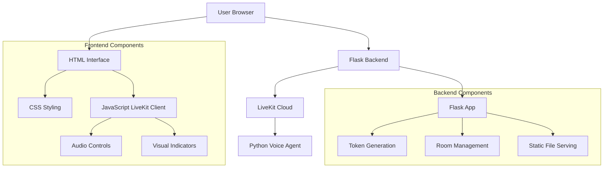
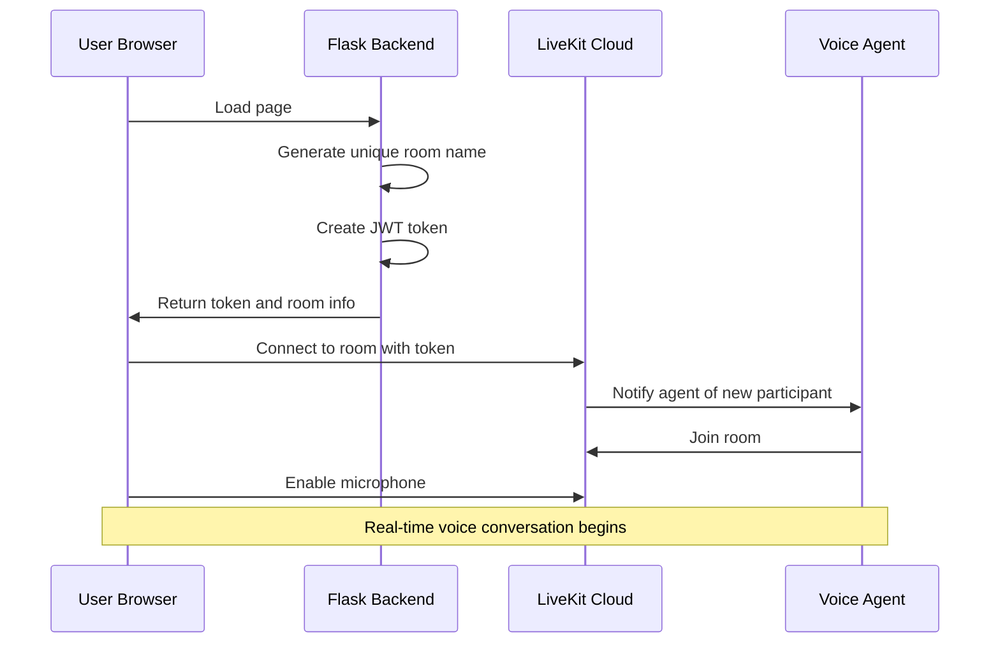

# LiveKit Voice Agent Frontend Implementation Plan

## Project Overview
Create a web-based frontend for your existing LiveKit Cloud Python voice agent with Flask backend and HTML/CSS/JavaScript frontend. The interface will auto-connect users to unique rooms and provide real-time voice interaction with visual feedback.

## Requirements Summary
- **Backend**: Flask for token generation and routing
- **Frontend**: HTML/CSS/JavaScript with LiveKit Client SDK
- **Auto-Connection**: No connect button - immediate connection on page load
- **Audio Controls**: Mute/unmute for both user mic and agent audio
- **Visual Indicators**: Speaking status and connection status
- **Transcription**: Real-time display of user speech and agent responses with fade effects
- **Room Management**: Unique room generation for each session

## Architecture Overview



## Technical Architecture

### Backend (Flask)
- **Token Generation**: Generate JWT tokens for LiveKit room access
- **Room Management**: Create unique room names for each session using UUID
- **API Endpoints**: RESTful endpoints for frontend communication
- **Static File Serving**: Serve HTML/CSS/JS files
- **Environment Configuration**: Secure storage of LiveKit API credentials

### Frontend (HTML/CSS/JS)
- **LiveKit Client Integration**: Use `livekit-client` SDK for WebRTC communication
- **Auto-Connection**: Connect to room immediately on page load
- **Audio Controls**: Mute/unmute for both user mic and agent audio
- **Visual Feedback**: Real-time connection and speaking indicators
- **Transcription Display**: Show current user input and agent response with fade effects

## Project Structure
```
livekit-voice-frontend/
├── app.py                 # Flask backend application
├── requirements.txt       # Python dependencies
├── .env                   # Environment variables (API keys)
├── static/
│   ├── index.html         # Main HTML interface
│   ├── style.css          # CSS styling and animations
│   └── script.js          # JavaScript client logic
└── README.md             # Documentation
```

## Detailed Implementation Plan

### Phase 1: Flask Backend Setup

#### 1.1 Flask Application Structure
- Create main Flask application (`app.py`)
- Set up environment variable configuration
- Create static file serving routes
- Configure CORS for frontend communication

#### 1.2 Token Generation Endpoint
- **Endpoint**: `GET /get-token`
- **Functionality**:
  - Generate unique room name using UUID
  - Create JWT token with LiveKit API credentials
  - Set appropriate token permissions and expiration
  - Return JSON response with token and room info

#### 1.3 Environment Configuration
- **Required Variables**:
  - `LIVEKIT_API_KEY`: LiveKit Cloud API Key
  - `LIVEKIT_API_SECRET`: LiveKit Cloud API Secret
  - `LIVEKIT_URL`: LiveKit Cloud WebSocket URL
  - `FLASK_ENV`: Development/Production environment

### Phase 2: Frontend HTML Structure

#### 2.1 Main Interface Elements
- **Connection Status Indicator**: Visual feedback for connection state
- **Speaking Status Indicators**: Real-time audio level visualization
- **Audio Controls**: 
  - User microphone mute/unmute toggle
  - Agent audio mute/unmute toggle
- **Transcription Display**: Area for real-time text display
- **Loading States**: Smooth loading animations

#### 2.2 HTML Structure
```html
<!DOCTYPE html>
<html lang="en">
<head>
    <meta charset="UTF-8">
    <meta name="viewport" content="width=device-width, initial-scale=1.0">
    <title>LiveKit Voice Agent</title>
    <link rel="stylesheet" href="style.css">
</head>
<body>
    <div class="container">
        <div class="status-bar">
            <div class="connection-status"></div>
            <div class="speaking-indicators">
                <div class="user-speaking"></div>
                <div class="agent-speaking"></div>
            </div>
        </div>
        
        <div class="controls">
            <button class="mic-toggle"></button>
            <button class="speaker-toggle"></button>
        </div>
        
        <div class="transcription-area">
            <div class="user-transcription"></div>
            <div class="agent-transcription"></div>
        </div>
    </div>
    
    <script src="https://cdn.jsdelivr.net/npm/livekit-client/dist/livekit-client.umd.min.js"></script>
    <script src="script.js"></script>
</body>
</html>
```

### Phase 3: LiveKit Client Integration

#### 3.1 Auto-Connection Flow


#### 3.2 JavaScript Implementation Structure
- **Token Fetching**: Get authentication token from Flask backend
- **Room Connection**: Connect to LiveKit room with auto-retry
- **Audio Management**: Handle microphone and speaker controls
- **Event Handling**: Process LiveKit events (connection, tracks, etc.)
- **UI Updates**: Real-time visual feedback and transcription display

#### 3.3 Key JavaScript Functions
```javascript
// Core functions to implement
async function fetchToken()
async function connectToRoom(token, roomName)
async function setupAudioTracks()
function handleSpeakingIndicators()
function updateTranscription(text, isUser)
function toggleMicrophone()
function toggleSpeaker()
```

### Phase 4: Visual Indicators & UI

#### 4.1 Connection Status
- **States**: Connected (green), Connecting (yellow), Disconnected (red)
- **Visual Elements**: Status dots, connection icons, smooth transitions

#### 4.2 Speaking Indicators
- **User Speaking**: Microphone icon with audio level visualization
- **Agent Speaking**: Speaker icon with audio level visualization
- **Implementation**: Real-time audio level monitoring and smooth animations

#### 4.3 Transcription Display
- **Real-time Updates**: Display text as it's transcribed
- **Fade-out Animation**: Text fades after conversation moves on
- **Styling**: Clean, readable typography with smooth transitions

### Phase 5: Audio Controls Implementation

#### 5.1 User Microphone Control
- **Mute/Unmute Toggle**: Visual button with state indication
- **Audio Level Monitoring**: Real-time feedback for user speech
- **Permission Handling**: Graceful handling of microphone permissions

#### 5.2 Agent Audio Control
- **Speaker Toggle**: Control agent audio output
- **Volume Control**: Optional volume adjustment
- **Audio Routing**: Proper audio element management

### Phase 6: Error Handling & Optimization

#### 6.1 Error Handling
- **Connection Failures**: Auto-retry with exponential backoff
- **Audio Permission Denied**: User-friendly error messages
- **Room Access Issues**: Token refresh and re-authentication
- **Network Disconnections**: Automatic reconnection attempts

#### 6.2 Performance Optimization
- **Efficient Audio Processing**: Minimize CPU usage
- **Smooth UI Animations**: 60fps animations with CSS transforms
- **Resource Cleanup**: Proper cleanup of WebRTC resources
- **Memory Management**: Prevent memory leaks in long sessions

## Key Features Implementation Details

### 1. Auto-Connection
- **Page Load Event**: Trigger connection immediately
- **Token Generation**: Fetch token from Flask backend
- **Room Connection**: Connect to LiveKit with generated token
- **Microphone Activation**: Request and enable microphone access

### 2. Visual Feedback System
- **Connection Status**: 
  - Green: Connected and ready
  - Yellow: Connecting or reconnecting
  - Red: Disconnected or error
- **Speaking Indicators**: 
  - Animated microphone icon for user
  - Animated speaker icon for agent
  - Audio level bars for visual feedback

### 3. Audio Controls
- **User Microphone**: Toggle with visual feedback
- **Agent Audio**: Toggle with visual feedback
- **State Persistence**: Remember user preferences
- **Keyboard Shortcuts**: Optional hotkeys for quick control

### 4. Transcription Display
- **Real-time Updates**: Display text as it's generated
- **Fade Animation**: 3-5 second fade-out after new speech
- **Clear Distinction**: Different styling for user vs agent text
- **Smooth Transitions**: CSS transitions for text changes

### 5. Unique Room Management
- **UUID Generation**: Create unique room identifiers
- **Session Isolation**: Each user gets their own room
- **Room Cleanup**: Automatic cleanup after disconnect

## Technology Stack

### Backend
- **Flask**: Python web framework
- **LiveKit Python SDK**: Token generation and room management
- **python-dotenv**: Environment variable management
- **Flask-CORS**: Cross-origin resource sharing

### Frontend
- **HTML5**: Semantic markup and structure
- **CSS3**: Modern styling with animations and transitions
- **JavaScript ES6+**: Modern JavaScript features
- **LiveKit Client SDK**: WebRTC and real-time communication
- **Fetch API**: HTTP requests to backend

### Development Tools
- **Virtual Environment**: Python dependency isolation
- **Environment Variables**: Secure credential management
- **Modern Browser**: WebRTC and modern web API support

## Security Considerations

### 1. API Key Protection
- Store credentials in environment variables
- Never expose API keys in client-side code
- Use appropriate token expiration times

### 2. Token Security
- JWT tokens with proper expiration
- Room-specific permissions
- Secure token transmission over HTTPS

### 3. Input Validation
- Validate all user inputs on backend
- Sanitize data before processing
- Implement rate limiting for API endpoints

### 4. CORS Configuration
- Configure appropriate CORS headers
- Restrict origins in production
- Secure cookie and session handling

## Deployment Considerations

### Development Environment
- Local Flask development server
- Environment variable configuration
- Hot reload for development

### Production Deployment
- WSGI server (Gunicorn, uWSGI)
- Reverse proxy (Nginx, Apache)
- HTTPS configuration
- Environment-specific configurations

## Testing Strategy

### Unit Testing
- Backend API endpoint testing
- Token generation validation
- Error handling verification

### Integration Testing
- LiveKit connection testing
- Audio functionality testing
- End-to-end user flow testing

### Browser Testing
- Cross-browser compatibility
- Mobile device testing
- WebRTC feature detection

## Success Metrics
- **Connection Time**: Sub-second connection establishment
- **Audio Quality**: Clear, low-latency audio communication
- **User Experience**: Intuitive, responsive interface
- **Error Handling**: Graceful error recovery
- **Performance**: Smooth animations and real-time updates

## Future Enhancements
- **Mobile App**: React Native or Flutter implementation
- **Multi-language Support**: Internationalization
- **Advanced Analytics**: Usage tracking and insights
- **Custom Themes**: User interface customization
- **Accessibility**: Screen reader and keyboard navigation support

---

## Next Steps
1. Set up development environment
2. Implement Flask backend with token generation
3. Create HTML/CSS interface
4. Integrate LiveKit Client SDK
5. Implement audio controls and visual feedback
6. Add error handling and optimization
7. Test across different browsers and devices
8. Deploy to production environment

This plan provides a comprehensive roadmap for implementing your LiveKit voice agent frontend with all the specified requirements and features.