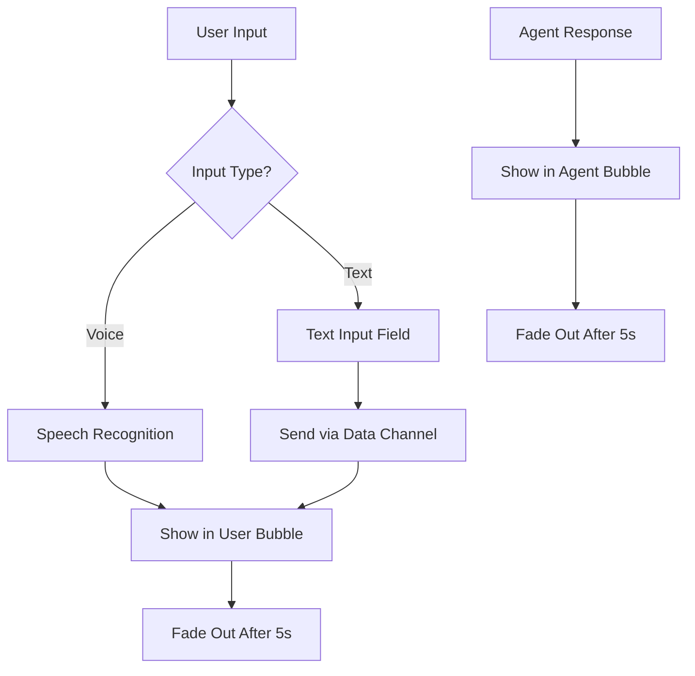
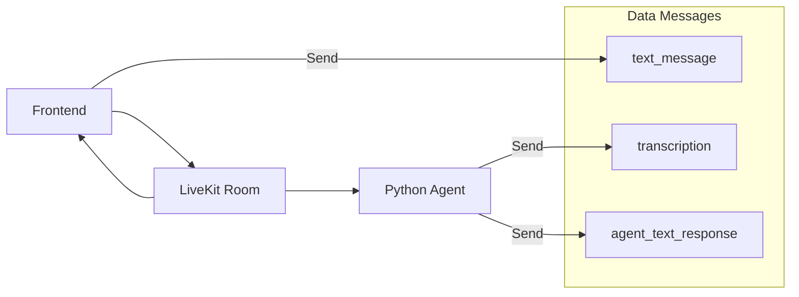

# Text Input & Transcription Enhancement Plan

## Overview
Enhance the LiveKit voice agent frontend to support both voice and text input while maintaining the current fade-out behavior for messages. Fix transcription display to properly show voice interactions.

## Current Status Analysis
- ✅ Voice connection working perfectly
- ✅ Audio tracks publishing/subscribing correctly
- ✅ Speaking indicators functional
- ❌ No transcription text appearing (agent not sending expected data format)
- ❌ No text input capability for users

## Goals
1. Add text input field for typing messages to the agent
2. Fix voice transcription display by handling data messages properly
3. Maintain existing fade-out behavior (no persistent chat history)
4. Unified display for both voice transcriptions and typed text

## Implementation Plan

### Phase 1: Add Text Input UI Components

#### 1.1 HTML Structure Updates
Add text input section to `static/index.html`:
```html
<div class="text-input-section">
    <div class="input-container">
        <input type="text" id="textInput" placeholder="Type your message..." />
        <button class="send-btn" id="sendBtn">
            <i class="fas fa-paper-plane"></i>
        </button>
    </div>
</div>
```

#### 1.2 CSS Styling Updates
Add styles to `static/style.css`:
- Input field with modern design
- Send button with hover effects
- Responsive layout integration
- Focus states and animations

### Phase 2: JavaScript Functionality Enhancement

#### 2.1 Text Input Handling
Add to `static/script.js`:
```javascript
// New properties
this.textInput = document.getElementById('textInput');
this.sendBtn = document.getElementById('sendBtn');

// New methods
setupTextInputListeners()
sendTextMessage(text)
handleTextInput()
```

#### 2.2 Data Message Communication
Enhanced data handling for multiple message types:
```javascript
// Send to agent
{
    "type": "text_message",
    "content": "user typed message",
    "timestamp": 1641234567890
}

// Receive from agent (existing functionality enhanced)
{
    "type": "transcription",
    "speaker": "user",
    "text": "transcribed voice input"
}
{
    "type": "transcription", 
    "speaker": "agent",
    "text": "agent voice response transcription"
}
{
    "type": "agent_text_response",
    "content": "agent text reply"
}
```

### Phase 3: Unified Message Display System

#### 3.1 Enhanced Transcription Function
Update `updateTranscription()` method to handle:
- Voice transcriptions (existing)
- Typed text messages (new)
- Agent text responses (new)
- Maintain existing 5-second fade-out timing

#### 3.2 Message Source Indication
Visual indicators to show message origin:
- Voice input: microphone icon
- Text input: keyboard icon
- Same bubble styling and fade behavior

### Phase 4: LiveKit Data Channel Integration

#### 4.1 Send Text Messages
```javascript
async sendTextMessage(text) {
    if (!this.room || !this.isConnected) return;
    
    const message = {
        type: "text_message",
        content: text,
        timestamp: Date.now()
    };
    
    const encoder = new TextEncoder();
    const data = encoder.encode(JSON.stringify(message));
    
    await this.room.localParticipant.publishData(data, {
        reliable: true
    });
    
    // Show user's typed message
    this.updateTranscription(text, true);
}
```

#### 4.2 Enhanced Data Reception
Update `handleDataReceived()` to process:
- Existing transcription data
- New agent text responses
- Error handling for malformed data

## Technical Specifications

### User Interface Flow


### Data Flow Architecture


## Implementation Details

### New DOM Elements
- `textInput`: Input field for typing messages
- `sendBtn`: Button to send typed messages
- Enhanced event listeners for Enter key and button clicks

### Enhanced JavaScript Methods
1. `setupTextInputListeners()` - Set up text input event handlers
2. `sendTextMessage(text)` - Send text via LiveKit data channel
3. `handleTextInput()` - Process text input events
4. `clearTextInput()` - Clear input field after sending
5. Enhanced `handleDataReceived()` - Process multiple message types

### CSS Enhancements
- `.text-input-section` - Container for text input
- `.input-container` - Flex layout for input and button
- `.send-btn` - Styled send button with animations
- Responsive design adjustments

### Expected Agent Integration
The Python agent needs to:
1. **Listen for text messages** via data channel
2. **Send transcription data** for voice interactions
3. **Send text responses** when appropriate
4. **Handle both input types** seamlessly

### Data Format Examples

#### Client to Agent (Text Message)
```json
{
    "type": "text_message",
    "content": "Hello, how are you?",
    "timestamp": 1641234567890
}
```

#### Agent to Client (Voice Transcription)
```json
{
    "type": "transcription",
    "speaker": "user",
    "text": "Hello, how are you?"
}
```

#### Agent to Client (Text Response)
```json
{
    "type": "agent_text_response", 
    "content": "I'm doing well, thank you for asking!"
}
```

## Testing Strategy

### Functional Testing
1. **Text Input**: Verify typing and sending works
2. **Voice Transcription**: Test with agent data messages
3. **Fade Behavior**: Confirm 5-second fade-out timing
4. **Data Communication**: Test LiveKit data channel messaging
5. **Mixed Input**: Alternate between voice and text

### UI/UX Testing
1. **Responsive Design**: Test on different screen sizes
2. **Keyboard Navigation**: Tab through inputs, Enter to send
3. **Visual Feedback**: Button states, input focus
4. **Error Handling**: Network issues, invalid data

### Integration Testing
1. **Agent Communication**: Bidirectional data flow
2. **Connection Recovery**: Reconnection after disconnect
3. **Performance**: Message handling under load

## Success Criteria
- ✅ Users can type messages and send to agent
- ✅ Voice transcriptions appear when agent sends data
- ✅ Both text and voice inputs show in same user bubble style
- ✅ Existing 5-second fade-out behavior maintained
- ✅ Responsive design works on mobile and desktop
- ✅ Keyboard shortcuts work (Enter to send)
- ✅ Error handling for connection issues

## Future Considerations
- Message delivery status indicators
- Typing indicators while user is typing
- Voice activity detection improvements
- Enhanced error messaging
- Accessibility improvements (screen readers)

---

This plan maintains the existing voice functionality while adding seamless text input capability, keeping the clean fade-out behavior you prefer without cluttering the interface with chat history.